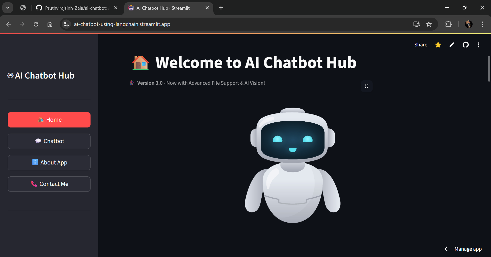
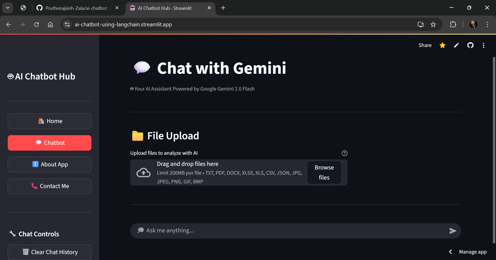
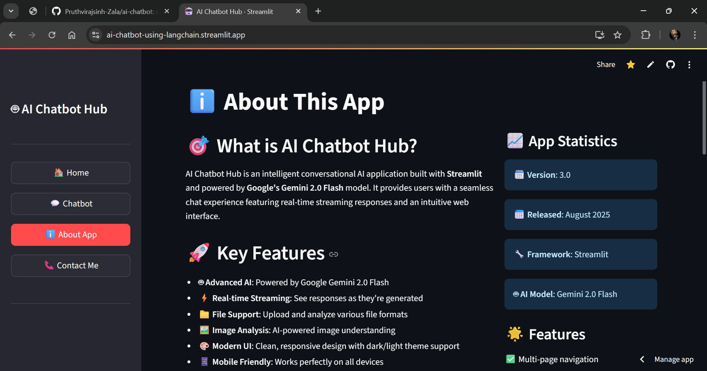
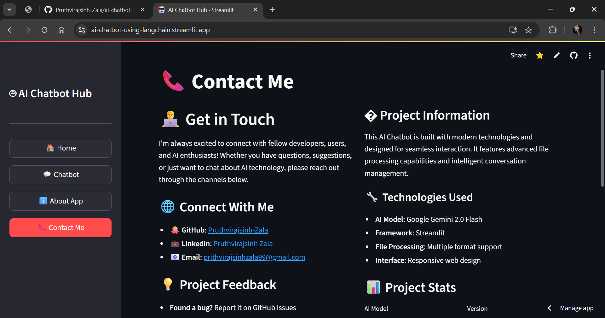
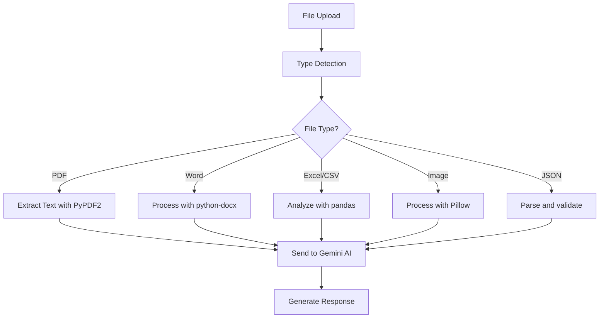

# 🤖 AI Chatbot Hub


[](https://python.org)
[](https://streamlit.io)
[](https://ai.google.dev/)
[](LICENSE)


> **A powerful, multi-format file-processing AI chatbot powered by Google's Gemini 2.0 Flash model**


Transform your conversations with an intelligent AI assistant that can analyze documents, process images, and provide contextual insights across multiple file formats.


## ✨ Features


### 🧠 **Advanced AI Capabilities**
- **Powered by Google Gemini 2.0 Flash** - Latest AI model for superior performance
- **Real-time streaming responses** - Smooth, natural conversation flow
- **Contextual understanding** - Maintains conversation context across interactions
- **Multi-modal intelligence** - Text, document, and image understanding


### 📁 **Comprehensive File Support**
| File Type | Extensions | AI Capabilities |
|-----------|-----------|-----------------|
| 📄 **Text Documents** | `.txt` | Content analysis, summarization, Q&A |
| 📄 **PDF Files** | `.pdf` | Text extraction, document insights |
| 📄 **Word Documents** | `.docx` | Content review, key points extraction |
| 📊 **Spreadsheets** | `.xlsx`, `.xls` | Data analysis, trend identification |
| 📊 **CSV Files** | `.csv` | Pattern recognition, statistical insights |
| 🔧 **JSON Files** | `.json` | Structure analysis, data validation |
| 🖼️ **Images** | `.jpg`, `.png`, `.gif` | Visual understanding, content description |


### 🎯 **Smart Features**
- **📱 Responsive Design** - Works seamlessly on desktop and mobile
- **🔍 Real-time Processing** - Live progress indicators for file uploads
- **📊 Chat Analytics** - Track conversation statistics
- **🗑️ Quick Controls** - Easy chat history management
- **🔒 Secure Processing** - Enterprise-grade security with Google AI

## 🚀 Quick Start

### Prerequisites
- Python 3.8 or higher
- Google AI API key ([Get one here](https://ai.google.dev/))

### Installation


1. **Clone the repository**
   ```bash
   git clone https://github.com/Pruthvirajsinh-Zala/ai-chatbot.git
   cd ai-chatbot
   ```

2. **Create a virtual environment**
   ```bash
   python -m venv chatbot
   source chatbot/bin/activate  # On Windows: chatbot\Scripts\activate
   ```

3. **Install dependencies**
   ```bash
   pip install -r requirements.txt
   ```

4. **Set up your Google AI API key**
   
   Create a `.streamlit/secrets.toml` file:
   ```toml
   GOOGLE_API_KEY = "your_api_key_here"
   ```
   
   Or set it as an environment variable:
   ```bash
   export GOOGLE_API_KEY="your_api_key_here"
   ```

5. **Run the application**
   ```bash
   streamlit run streamlit_app.py
   ```

6. **Open your browser** and navigate to `http://localhost:8501`

## 📖 How to Use

### 💬 **Basic Chat**
1. Navigate to the **Chatbot** tab in the sidebar
2. Type your message and press Enter
3. Enjoy real-time AI responses with streaming text
4. Use the "Clear Chat History" button to start fresh

### 📁 **File Analysis**
1. Go to the **Chatbot** page
2. Use the file uploader to select your document/image
3. Preview the processed content
4. Ask questions about the uploaded file
5. Get AI-powered insights and analysis

### 🎯 **Pro Tips**
- **Multiple files**: Upload different file types for comprehensive analysis
- **Specific questions**: Ask detailed questions about your documents for better insights
- **Image analysis**: Upload screenshots, charts, or diagrams for visual understanding
- **Data insights**: Upload CSV/Excel files for statistical analysis and trends

## � Screenshots

### 🏠 **Home Page**
Get started with an overview of all features and capabilities.



### 💬 **Chatbot Interface**
Experience seamless AI conversations with file upload capabilities.



### ℹ️ **About App**
Learn more about the application's features and technical details.



### 📞 **Contact Page**
Connect with the developer and get support.



## �🛠️ Technical Details

### Architecture
```
📦 AI Chatbot Hub
├── 🎨 Frontend (Streamlit)
├── 🧠 AI Engine (Google Gemini 2.0 Flash)
├── 📁 File Processors
│   ├── PDF Handler (PyPDF2)
│   ├── Document Processor (python-docx)
│   ├── Spreadsheet Analyzer (pandas, openpyxl)
│   └── Image Processor (Pillow)
└── 🔐 Security Layer
```

### Dependencies
- **`streamlit`** - Web application framework
- **`google-generativeai`** - Google AI integration
- **`PyPDF2`** - PDF text extraction
- **`python-docx`** - Word document processing
- **`openpyxl`** - Excel file handling
- **`pandas`** - Data analysis and CSV processing
- **`Pillow`** - Image processing capabilities

### File Processing Pipeline


## 📈 Version History

### 🎉 **Version 3.0** - Advanced File Support & AI Vision *(Current)*
- ✅ Multi-format file upload (8+ file types)
- ✅ AI-powered image analysis with Gemini Vision
- ✅ Smart document processing (PDF, Word, Excel)
- ✅ Real-time file processing with progress indicators
- ✅ Contextual conversations about uploaded files
- ✅ Enhanced UI/UX with tabbed interfaces
- ✅ Robust error handling for all file types

### 📱 **Version 2.0** - Multi-Page Navigation
- ✅ Multi-page navigation system
- ✅ Improved error handling and user feedback
- ✅ Real-time chat statistics and analytics
- ✅ Enhanced responsive design
- ✅ Sidebar navigation controls

### 🎯 **Version 1.0** - Core Chatbot
- ✅ Basic AI chatbot functionality
- ✅ Google Gemini integration
- ✅ Simple text-based conversations

## 🤝 Contributing

Contributions are welcome! Here's how you can help:

1. **Fork the repository**
2. **Create a feature branch**: `git checkout -b feature/amazing-feature`
3. **Make your changes** and add tests if applicable
4. **Commit your changes**: `git commit -m 'Add amazing feature'`
5. **Push to the branch**: `git push origin feature/amazing-feature`
6. **Open a Pull Request**

### Development Setup
```bash
# Install development dependencies
pip install -r requirements.txt

# Run with debug mode
streamlit run streamlit_app.py --server.runOnSave true

# Test file processing
python -m pytest tests/ -v
```

## 📄 License

This project is licensed under the MIT License - see the [LICENSE](LICENSE) file for details.

## 🌟 Acknowledgments

- **Google AI** for the powerful Gemini 2.0 Flash model
- **Streamlit** for the amazing web framework
- **Open Source Community** for the excellent libraries used in this project

## 📞 Support

- 📧 **Email**: [prithvirajsinhzala99@gmail.com]
- 💬 **Issues**: [GitHub Issues](https://github.com/Pruthvirajsinh-Zala/ai-chatbot/issues)
- 🌟 **Star this repo** if you found it helpful!

---

<div align="center">

**Made with ❤️ by [Pruthvirajsinh Zala](https://github.com/Pruthvirajsinh-Zala)**

⭐ **Star this repository if you found it useful!** ⭐

</div>

